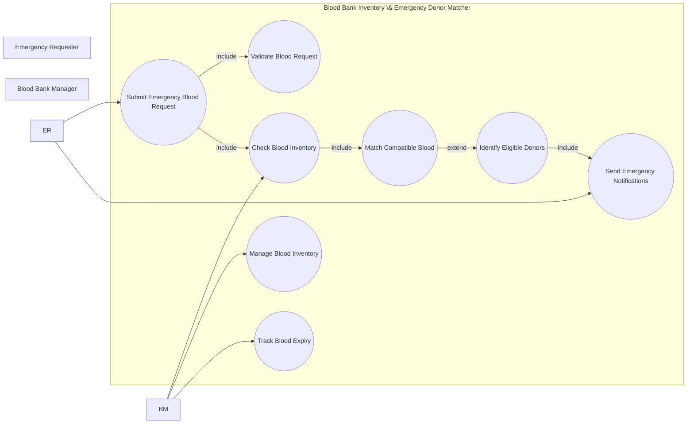

```mermaid

flowchart LR


ER\[Emergency Requester]

BM\[Blood Bank Manager]


subgraph System\[Blood Bank Inventory \& Emergency Donor Matcher]


UC1((Submit Emergency Blood Request))

UC2((Validate Blood Request))

UC3((Check Blood Inventory))

UC4((Match Compatible Blood))

UC5((Identify Eligible Donors))

UC6((Send Emergency Notifications))

UC7((Manage Blood Inventory))

UC8((Track Blood Expiry))


UC1 -->|include| UC2

UC1 -->|include| UC3

UC3 -->|include| UC4

UC4 -->|extend| UC5

UC5 -->|include| UC6


end


ER --> UC1

ER --> UC6

BM --> UC3

BM --> UC7

BM --> UC8

```

